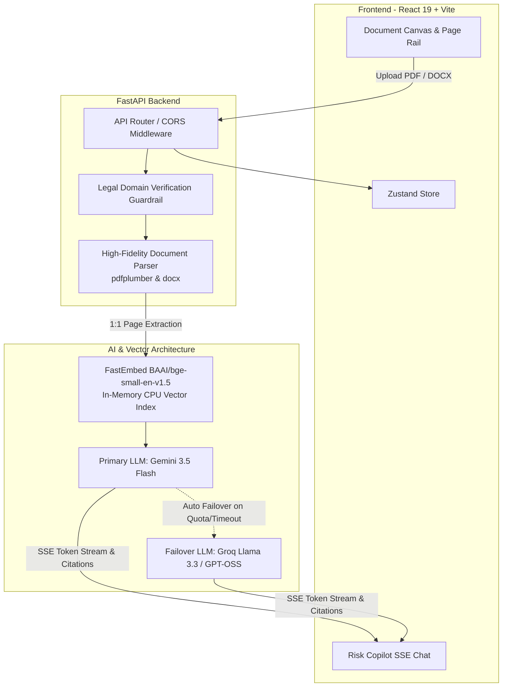

<div align="center">

# 🧭 LegalCompass

**The AI-Powered Contract Risk Copilot & Interactive Document Inspector**

*Detect predatory clauses, audit asymmetric liabilities, and simulate real-world legal scenarios before you sign.*

[](https://www.typescriptlang.org/)
[](https://react.dev/)
[](https://vitejs.dev/)
[](https://tailwindcss.com/)
[](https://fastapi.tiangolo.com/)
[](https://www.python.org/)
[](https://aistudio.google.com/)
[](https://groq.com/)
[](LICENSE)

</div>

---

## 📌 Executive Summary

Contracts are intentionally drafted with complex legalese, asymmetric liabilities, and hidden pitfalls that expose freelancers, businesses, and tenants to substantial financial and operational risk.

**LegalCompass** is an enterprise-grade AI legal copilot and interactive document inspector engineered to level the playing field. It segments contracts into structured covenants, computes an objective **Fairness Score (0–100)**, identifies predatory traps (e.g., uncapped indemnification, IP forfeiture without payment, unilateral immediate termination), and enables **interactive what-if scenario simulations** using a zero-hallucination Retrieval-Augmented Generation (RAG) pipeline.

---

## ⚡ Key Highlights & Architecture



---

## ✨ Core Features

### 1. Dual-Scroll Document Reader (1:1 Exact Page Fidelity)
- **Zero Content Summarization / No Text Alteration**: The actual contract text is extracted directly from the physical PDF/Word document with 100% verbatim accuracy, preserving page breaks, indentation, tables, and signature blocks.
- **Left Page Rail (`Page 1` … `Page 10`)**: Instant vertical thumbnail navigation with dynamic high-risk indicator badges.
- **Inline Marker Highlights**: Risk clauses are highlighted directly on the reading canvas without altering or rewriting a single character. Clicking a highlight jumps straight to risk remediation.

### 2. Dual-Provider LLM Orchestration with Zero-Downtime Failover
- **Primary Engine**: **Google Gemini 3.5 Flash** for rapid reasoning, clause risk scoring, and counter-clause drafting.
- **Automatic Secondary Failover**: If Gemini encounters rate limits or network degradation, the system seamlessly transitions to **Groq Cloud (Llama 3.3 / GPT-OSS 120B)** in `<50ms` without dropping the active session.

### 3. Local In-Memory FastEmbed RAG (Zero External Database Dependency)
- Semantic embeddings computed locally via **FastEmbed** (`BAAI/bge-small-en-v1.5`) running entirely on CPU.
- Vector similarity search indexes clauses into RAM for real-time contextual citations during simulation chats.

### 4. Interactive What-If Scenario Simulator
- Test agreements against realistic business stressors before executing:
  - *"What happens if the client cancels the project midway through development?"*
  - *"Can I reuse my proprietary software frameworks for other clients?"*
  - *"Can the landlord enter unannounced at midnight?"*
  - *"What are my late payment interest remedies under Section 8?"*

### 5. Out-of-Domain Guardrails & Rejection Notice
- Upload verification ensures non-legal documents (e.g. recipes, raw code, shopping lists) are rejected with a clear, polite explanation rather than hallucinating legal terms.
- Copilot chat boundaries prevent off-topic drift, maintaining strict legal compliance.

---

## 🛠️ Technology Stack

| Domain | Technology | Purpose |
| :--- | :--- | :--- |
| **Frontend Framework** | **React 19** + **TypeScript 5.7** | Next-generation reactive web application |
| **Build & Tooling** | **Vite 6** + **PostCSS** | Lightning-fast HMR and optimized production bundles |
| **Styling & Icons** | **Tailwind CSS 3.4** + **Lucide React** | Sleek editorial legal design system & responsive UI |
| **State Management** | **Zustand 5** | Lightweight, reactive client state architecture |
| **Backend Framework** | **FastAPI 0.115** (Python 3.10+) | High-performance asynchronous API server |
| **Server Engine** | **Uvicorn** (ASGI) | Asynchronous production web server |
| **PDF Extraction** | **pdfplumber** + **pypdf** | 1:1 physical page structure & table parsing |
| **DOCX Extraction** | **python-docx** | Formatted Word document clause ingestion |
| **Vector Embeddings** | **FastEmbed (ONNX)** | In-memory BAAI/bge-small embeddings on CPU |
| **Primary AI Provider** | **Google Gemini (3.5 Flash)** | Primary legal clause audit & scenario synthesis |
| **Failover AI Provider** | **Groq Cloud** | High-throughput sub-second failover inference |

---

## 📂 Repository Structure

```text
LegalCompass/
├── public/                               # Static web assets
├── src/                                  # Frontend Application Source
│   ├── components/
│   │   ├── common/
│   │   │   ├── AnalysisProgress.tsx      # 3-stage animated analysis progress bar
│   │   │   ├── LandingHero.tsx           # Hero dropzone with feature highlights
│   │   │   ├── LawyerBriefModal.tsx      # Attorney brief export modal
│   │   │   └── UploadModal.tsx           # Contract ingestion & dropzone modal
│   │   ├── document/
│   │   │   ├── DocumentPanel.tsx         # Left panel host
│   │   │   └── pageView/
│   │   │       ├── PageCanvas.tsx        # Reading canvas with verbatim text
│   │   │       ├── PageRail.tsx          # Vertical thumbnail navigation rail
│   │   │       └── PageView.tsx          # Dual-scroll coordinator
│   │   ├── layout/
│   │   │   ├── Navbar.tsx                # Branding & upload trigger
│   │   │   └── SplitPane.tsx             # Resizable split workspace
│   │   └── chat/
│   │       ├── ActionChips.tsx           # Suggested scenario prompts
│   │       ├── ChatInput.tsx             # Copilot query input
│   │       ├── ChatMessage.tsx           # Markdown message bubble with citations
│   │       └── ChatPanel.tsx             # Copilot conversation panel
│   ├── services/
│   │   └── api.ts                        # Axios & fetch client with SSE streaming
│   ├── store/
│   │   └── useAppStore.ts                # Zustand central application store
│   ├── types/                            # Contract & Chat TypeScript definitions
│   ├── App.tsx                           # Main layout & keyboard shortcut handler
│   └── main.tsx                          # React 19 root entrypoint
│
├── legalcompass-backend/                 # FastAPI Backend Service
│   ├── app/
│   │   ├── api/
│   │   │   └── routes/
│   │   │       ├── chat.py               # SSE streaming simulation endpoint
│   │   │       ├── export.py             # Attorney PDF brief generator
│   │   │       ├── health.py             # Health check & multi-LLM status
│   │   │       ├── simulate.py           # What-if scenario evaluator
│   │   │       └── upload.py             # Document parser & domain validator
│   │   ├── core/
│   │   │   ├── config.py                 # Pydantic Settings & environment loader
│   │   │   └── prompts.py                # System prompts with domain guardrails
│   │   ├── schemas/                      # Pydantic request & response models
│   │   └── services/
│   │       ├── document_parser.py        # 1:1 page extraction for PDF & DOCX
│   │       ├── llm_service.py            # Gemini & Groq dual-provider client
│   │       └── rag_engine.py             # FastEmbed vector index in RAM
│   ├── requirements.txt                  # Python dependencies
│   ├── .env.example                      # Backend environment template
│   └── .gitignore                        # Backend-specific ignore rules
│
├── .env.example                          # Frontend environment template
├── .gitignore                            # Root gitignore protecting all secrets
├── package.json                          # Node dependencies and scripts
├── tailwind.config.js                    # Tailwind typography and theme tokens
├── tsconfig.json                         # TypeScript configuration
└── README.md                             # Project documentation
```

---

## 🚀 Getting Started

### Prerequisites
- **Node.js** `>= 18.0.0`
- **Python** `>= 3.10.0`
- *(Optional but recommended)* Free API Keys:
  - [Google AI Studio](https://aistudio.google.com/) for Gemini 3.5 Flash
  - [Groq Console](https://console.groq.com/) for Groq Failover

---

### Step 1: Clone Repository
```bash
git clone https://github.com/your-username/legalcompass.git
cd legalcompass
```

---

### Step 2: Configure Environment Variables

1. **Root (Frontend) Configuration**:
   ```bash
   cp .env.example .env
   ```
   *Default `.env` contents:*
   ```ini
   VITE_API_BASE_URL=http://localhost:8000/api
   VITE_USE_MOCK=false
   ```

2. **Backend Configuration**:
   ```bash
   cd legalcompass-backend
   cp .env.example .env
   ```
   *Add your API keys inside `legalcompass-backend/.env`:*
   ```ini
   PORT=8000
   HOST=0.0.0.0
   ENVIRONMENT=development

   # Gemini Configuration
   GEMINI_API_KEY=your_gemini_api_key_here
   GEMINI_MODEL_ID=gemini-3.5-flash

   # Groq Failover Configuration
   GROQ_API_KEY=your_groq_api_key_here
   GROQ_MODEL_ID=openai/gpt-oss-120b

   # Embedding Engine (100% Local CPU, No Key Needed)
   EMBEDDING_MODEL=BAAI/bge-small-en-v1.5
   MAX_UPLOAD_SIZE_BYTES=26214400
   ```
   ```bash
   cd ..
   ```

---

### Step 3: Install & Start the Backend

1. Create and activate a Python virtual environment:
   ```bash
   cd legalcompass-backend
   python -m venv .venv
   ```
   - **Windows (PowerShell)**:
     ```powershell
     .\.venv\Scripts\Activate.ps1
     ```
   - **macOS / Linux**:
     ```bash
     source .venv/bin/activate
     ```

2. Install Python packages:
   ```bash
   pip install -r requirements.txt
   ```

3. Launch the FastAPI server:
   ```bash
   python -m uvicorn app.main:app --host 0.0.0.0 --port 8000 --reload
   ```
   *Verify backend is live at: [http://localhost:8000/api/health](http://localhost:8000/api/health)*

---

### Step 4: Install & Start the Frontend

Open a new terminal window in the project root:

```bash
# Install node dependencies
npm install

# Start Vite development server
npm run dev
```

Open your browser and navigate to: **[http://localhost:5173/](http://localhost:5173/)**

---

## 🔒 Security & Privacy Practices

- **Zero Document Retention**: Uploaded contracts are held transiently in memory for clause segmentation and vectorization during your session. No documents are permanently written to public databases.
- **Zero Hallucination Grounding**: RAG pipeline embeds exact original text with clause ID provenance, preventing fabricated contract terms.
- **Protected Secrets**: Local `.env` and `.venv/` directories are strictly excluded via `.gitignore` to prevent credential exposure.

---

## ⌨️ Global Keyboard Shortcuts

| Shortcut | Action |
| :--- | :--- |
| `Ctrl + K` / `⌘ + K` | Open Document Upload Modal & Ingestion Hub |
| `Ctrl + P` / `⌘ + P` | Export Formal Attorney Consultation Brief (PDF) |
| `Esc` | Dismiss modals or cancel active dialog |

---

## 📄 License

This project is licensed under the **MIT License** — see the [LICENSE](LICENSE) file for details.

---

<div align="center">
  <sub>Engineered with precision for fair, transparent, and balanced contractual agreements.</sub>
</div>
