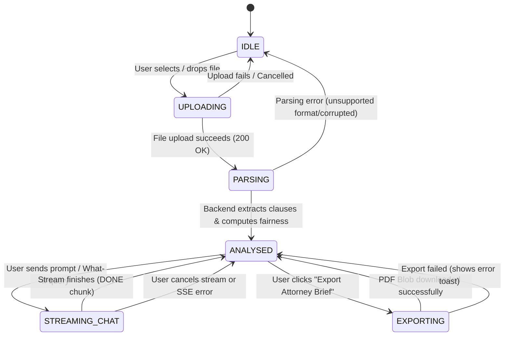

# LegalCompass — Frontend Architectural Specification

**Document Version:** 1.0.0  
**Status:** Approved Architectural Specification  
**Target Audience:** Frontend Engineers, Fullstack AI Engineers, UI/UX Designers  
**Project:** LegalCompass (GenAI-Powered Legal Risk Analysis & Contract Navigation Platform)

---

## 1. Executive Summary & Product Mission

LegalCompass is an interactive GenAI-powered legal risk analysis and contract navigation platform engineered specifically for non-lawyers: freelancers, tenants, indie contractors, and small business owners. 

Non-lawyers are routinely confronted with dense, boilerplate legal agreements laden with one-sided indemnification clauses, ambiguous IP assignment terms, punitive termination penalties, and concealed liability traps. Traditional legal review is prohibitively expensive, while generic LLM chats lack contextual grounding, document persistence, and interactive clause navigation.

LegalCompass bridges this divide through:
1. **Context-Aware Visual Navigation:** Grounding complex legalese in an interactive, heat-mapped contract viewer where every clause is scored for fairness and translated into plain English.
2. **Conversational "What-If" Simulation:** Allowing users to query practical scenarios (e.g., *"What happens if the client delays payment by 45 days?"*) with direct citations to specific contract sections.
3. **Actionable Counter-Proposals:** Supplying balanced pushback clauses and negotiation strategies that can be copied directly into negotiations or exported as a structured attorney brief.

---

## 2. Layout Architecture

LegalCompass employs a high-density, low-friction dual-pane workspace designed for continuous visual cross-referencing between the source contract and the conversational intelligence engine.

```
+----------------------------------------------------------------------------------------------------+
|  TOP NAVIGATION BAR                                                                                |
|  [Logo & Branding] | [Document Title & Status Pill] | [Fairness Badge] | [Upload CTA] [Export PDF] |
+----------------------------------------------------+-----------------------------------------------+
|  LEFT PANEL: DOCUMENT VIEWER & HEATMAP (50%)       |  RIGHT PANEL: AI COPILOT & SIMULATION (50%)   |
|  +-----------------------------------------------+ | +-------------------------------------------+ |
|  | Document Controls: Zoom, Search, Filter       | | | Mode Switcher: [Chat] [What-If] [Pushback]| |
|  +-----------------------------------------------+ | +-------------------------------------------+ |
|  | Rendered Document / Chunk Stream               | | | Scrollable Message Stream                 | |
|  | - Clause Highlighting (Green/Yellow/Red)       | | | - AI streaming tokens                     | |
|  | - Active Clause Selection Border               | | | - Interactive Citation Badges [Clause #3] | |
|  | - Sticky Risk Summary Callout                  | | | - Counter-clause diff cards               | |
|  | - Plain-English Inline Tooltip                 | | +-------------------------------------------+ |
|  |                                                | | | Suggested Action Chips                    | |
|  |                                                | | +-------------------------------------------+ |
|  |                                                | | | Query Input Box with Clause Context Tag   | |
|  +-----------------------------------------------+ | +-------------------------------------------+ |
|  | Clause Risk Heatmap Minibar (Bottom/Left Rail)| | | Pushback Drawer / Attorney Note Pad       | |
+----------------------------------------------------+-----------------------------------------------+
|  STICKY DISCLAIMER FOOTER                                                                          |
|  "LegalCompass is an informational analysis tool. Not certified legal advice. Consult an attorney."|
+----------------------------------------------------------------------------------------------------+
```

### 2.1 Top Navigation Bar
- **Branding & Identity:** `LegalCompass` logotype with an active compass glyph and version tag (`v1.0-alpha`).
- **Session & File Status Indicator:** Displays current document name (e.g., `Master_Services_Agreement_2026.pdf`), parse date, total extracted clauses, and real-time processing status badge (`PARSING`, `ANALYSED`, or `STREAMING`).
- **Global Risk & Fairness Pill:** A high-visibility dynamic gauge rendering the overall contract fairness score (0–100) with color token mapping (Red: `< 40`, Amber: `40–69`, Green: `≥ 70`).
- **Document Ingestion CTA:** Primary button triggering the unified File Dropzone Modal (`.pdf`, `.docx`, max 25MB).
- **Lawyer Brief Export Action:** Secondary action button triggering the `POST /api/export-brief` generation flow and downloading a curated, single-page executive summary PDF for professional attorney review.
- **Mandatory Safety Disclaimer Badge:** Unmissable pill: `"Informational Only · Not Professional Legal Advice"`.

### 2.2 Main Workspace: 2-Panel Resizable Split Screen
The workspace is powered by an accessible, drag-resizable `SplitPane` layout:
- **Left Panel (Document View & Clause Heatmap):**
  - High-fidelity PDF rendering / sanitized virtualized HTML text chunks.
  - Color-coded interactive clause highlights:
    - **High Risk (`RED`):** Unilateral liability, aggressive indemnification, non-competes, perpetual warranties.
    - **Medium Risk (`AMBER`):** Ambiguous payment terms, broad confidentiality, automatic renewals.
    - **Low / Fair (`GREEN`):** Mutual dispute resolution, standard IP ownership, standard force majeure.
  - Interactive selection state: Clicking any clause highlights its perimeter with an electric-cyan glow (`ring-2 ring-cyan-500`), sets `selected_clause_id` in the global store, and triggers relevant contextual actions in the right panel.
  - Interactive Clause Navigator & Mini-map: Vertical heatmap bar indicating density of risky clauses down the document margin.
- **Right Panel (Conversational AI Copilot & Scenario Simulator):**
  - **Conversational Stream:** SSE-based streaming response container showing real-time token rendering, Markdown syntax highlighting, and reactive citation buttons.
  - **Citation Anchors:** AI responses link directly to clause IDs (e.g., `[Clause 4.2]`). Clicking an anchor smoothly scrolls the left panel to the corresponding clause and highlights it.
  - **What-If Scenario Sandbox:** Pre-canned and custom hypothetical scenarios (e.g., *"Client goes bankrupt before Milestone 3"*, *"Client requests unlimited revisions"*).
  - **Pushback Clause Drawer:** Slide-over or tabbed panel presenting negotiation counter-clauses with copy-to-clipboard functionality and rationale explainers.

### 2.3 Split Screen Drag Mechanics
- **Default Ratio:** 50% / 50% split on screens $\ge 1440\text{px}$; 45% (Doc) / 55% (Chat) on screens between $1024\text{px}$ and $1439\text{px}$.
- **Panel Boundaries:** Hard boundaries enforced via JavaScript drag listener: Minimum Left Width: $360\text{px}$; Minimum Right Width: $400\text{px}$.
- **Storage Persistence:** Panel divider position saved to `localStorage.getItem('lc_split_ratio')` on drag end and restored upon session re-entry.
- **Keyboard Resizing:** Accessible keyboard control: Focusable splitter handle navigable via `ArrowLeft` / `ArrowRight` (adjusts by 2% increments) and `Home` / `End` (resets to 50/50).

---

## 3. Responsive Behavior & Viewport Breakpoints

| Breakpoint Range | Device Target | Layout Mode | Navigation & Panel Behavior |
| :--- | :--- | :--- | :--- |
| **Desktop (`≥ 1024px`)** | Laptops, Desktop Monitors, Ultrawides | Dual-Pane Side-by-Side | Simultaneous side-by-side view with interactive drag divider. Top navigation bar renders all status pills and action CTAs inline. |
| **Tablet (`768px – 1023px`)** | iPads, Android Tablets, Foldables | Segmented Tab Switcher | Viewport switches to a unified single container with a segmented controller at top: `[📄 Document (8)]` vs `[💬 AI Advisor]`. When a citation is tapped in Chat mode, UI switches to Document mode with a floating mini-preview bar. |
| **Mobile (`< 768px`)** | Mobile Smartphones (iOS / Android) | Stacked Drawer Hierarchy | Document viewer occupies primary viewport with a persistent floating bottom sheet: `"Ask AI about this contract"`. Dragging up expands the chat drawer to 90vh bottom sheet. |

---

## 4. Global UI State Machine

LegalCompass operates on a deterministic, finite state machine managed via Zustand. The UI transitions across six strict lifecycle phases:



### 4.1 State Definitions & UI Enforcements

#### 1. `IDLE`
- **Condition:** No active contract loaded or prior session reset.
- **Left Panel:** Displays `Dropzone` with drag-and-drop animation, supported file chips (`.PDF`, `.DOCX` up to 25MB), sample contract loaders (e.g., *"Try Freelance Web Dev Agreement"* or *"Try Residential Lease"*).
- **Right Panel:** Dimmed placeholder state with illustrative cards detailing capabilities (Clause Risk Scoring, Plain-English Breakdown, Scenario Simulation). Chat input disabled.
- **Top Bar:** Export Brief disabled; fairness score shows `--/100`.

#### 2. `UPLOADING`
- **Condition:** User dropped/selected a file; multipart POST payload in flight.
- **UI Presentation:** Dropzone displays determinate progress bar with upload percentage, file size counter, and cancel button.
- **Disallowed Actions:** Chat input disabled; top bar navigation actions disabled.

#### 3. `PARSING`
- **Condition:** File received by server; OCR, semantic chunking, and AI risk analysis executing.
- **UI Presentation:** Shimmer skeleton screen over both left and right panels.
- **Visual Feedback:** Stepped loading indicator animating through:
  1. *"Extracting text and identifying document layout..."*
  2. *"Isolating legal clauses and indemnification terms..."*
  3. *"Calculating overall fairness score & risk heatmaps..."*

#### 4. `ANALYSED`
- **Condition:** Contract structured data received (`session_id`, `clauses`, `overall_fairness_score`).
- **Left Panel:** High-fidelity document text rendered with interactive colored badges and risk highlights. First high-risk clause auto-focused.
- **Right Panel:** Chat Copilot activated with personalized initial summary:
  - Total clauses parsed.
  - Critical flags highlighted (e.g., *"Found 3 High-Risk clauses requiring pushback"*).
  - Ready-to-click Scenario Action Chips.
- **Top Bar:** Export Brief CTA enabled; Fairness Meter populated.

#### 5. `STREAMING_CHAT`
- **Condition:** User submitted a prompt or triggered a scenario simulation; SSE stream active.
- **Left Panel:** Active clauses cited by stream highlight dynamically as `citation` events arrive.
- **Right Panel:** Real-time token appending, auto-scrolling message list with smooth velocity dampening, blinking cursor indicator.
- **Controls:** Chat submit button transitions to a pulsing `"Stop Generating"` button (`AbortController.abort()`).

#### 6. `EXPORTING`
- **Condition:** `POST /api/export-brief` in flight.
- **UI Presentation:** Top bar export button renders spinning loader; subtle indeterminate progress overlay on the viewport.
- **Completion:** Triggers automatic browser file download (`LegalCompass_Attorney_Brief_<session_id>.pdf`) and returns to `ANALYSED`.

---

## 5. Design System & Theming Tokens

LegalCompass adheres to a modern, high-contrast, trustworthy palette built exclusively using Tailwind CSS utilities.

### 5.1 Color Tokens
- **Backgrounds:**
  - Base App Canvas: `bg-slate-950`
  - Panel Surface: `bg-slate-900/80 backdrop-blur-md`
  - Card & Container Surface: `bg-slate-800/60 border border-slate-700/50`
  - Interactive Hover: `hover:bg-slate-800/90 hover:border-slate-600`
- **Typography:**
  - Primary Headers: `text-slate-100 font-semibold tracking-tight`
  - Body Text: `text-slate-300 font-normal leading-relaxed`
  - Subtle / Metadata: `text-slate-400 text-xs`
  - Legalese Quote Block: `text-slate-200 font-mono text-xs bg-slate-950/70 p-3 rounded-lg border-l-2`
- **Legal Risk Severity Tokens:**
  - **High Risk (`CRITICAL`):** Border `border-rose-500/50`, Background `bg-rose-500/10`, Text `text-rose-400`, Badge `bg-rose-950/80 text-rose-300 border-rose-800`.
  - **Medium Risk (`CAUTION`):** Border `border-amber-500/50`, Background `bg-amber-500/10`, Text `text-amber-400`, Badge `bg-amber-950/80 text-amber-300 border-amber-800`.
  - **Low Risk (`FAIR`):** Border `border-emerald-500/50`, Background `bg-emerald-500/10`, Text `text-emerald-400`, Badge `bg-emerald-950/80 text-emerald-300 border-emerald-800`.
- **Accent & Interaction:**
  - Brand Primary: `bg-indigo-600 hover:bg-indigo-500 text-white shadow-lg shadow-indigo-500/20`
  - Focus Ring: `focus:outline-none focus:ring-2 focus:ring-cyan-400 focus:ring-offset-2 focus:ring-offset-slate-900`
  - Active Clause Selection: `ring-2 ring-cyan-400 shadow-md shadow-cyan-500/10`

---

## 6. Accessibility & Non-Lawyer Safety Guardrails

1. **Accessibility Standards (WCAG 2.1 AA Compliant):**
   - High color contrast ratio ($\ge 4.5:1$ for normal text, $\ge 3:1$ for large headings and badge indicators).
   - Keyboard accessible clause list: `Tab` to navigate clauses; `Enter` or `Space` to inspect and trigger explanation.
   - Screen reader announcements (`aria-live="polite"`) for streaming AI responses and status changes.
2. **Safety & Compliance Disclaimers:**
   - Persistent banner at bottom of workspace.
   - Every AI-generated counter-clause explicitly tags: *"Suggested wording for discussion with your contracting party or legal counsel."*
   - Exported attorney brief includes prominent header watermark: *"PREPARED WITH LEGALCOMPASS FOR ATTORNEY CONSULTATION · NOT LEGAL ADVICE"*.
